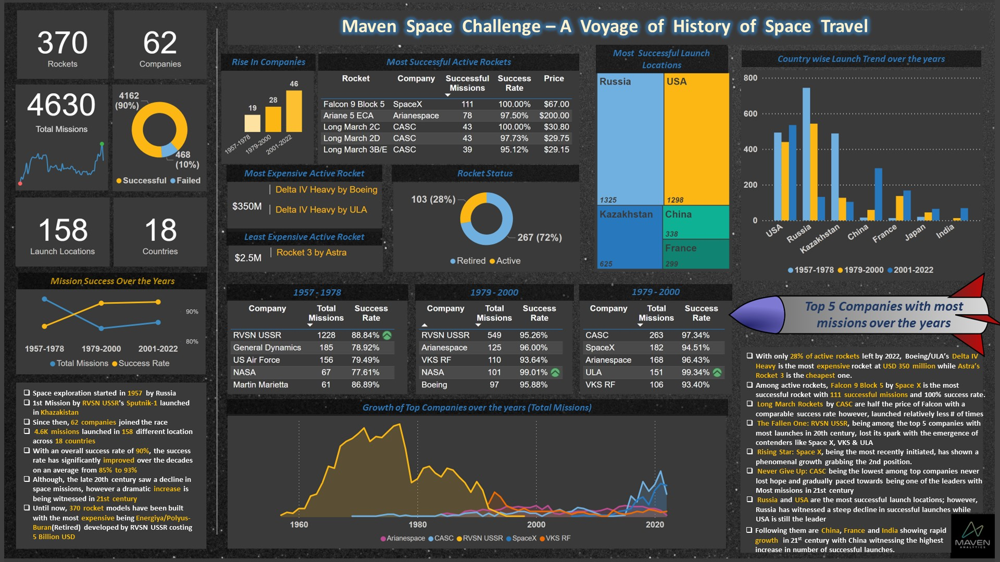

# Maven-Analytics-Space-Challenge

My submission for Maven Analytics Space Challenge - Capturing Awe of the History of Space Travel. This is a 1-page analysis report developed in Power BI.

- Captured the history of space travel, missons, rockets and locations of launches 
- Reported key Insights and takeaways by analyzing the space missions data and developed a story to explain the current trends in space travel, rise/fall of space launch companies and launch site countries

